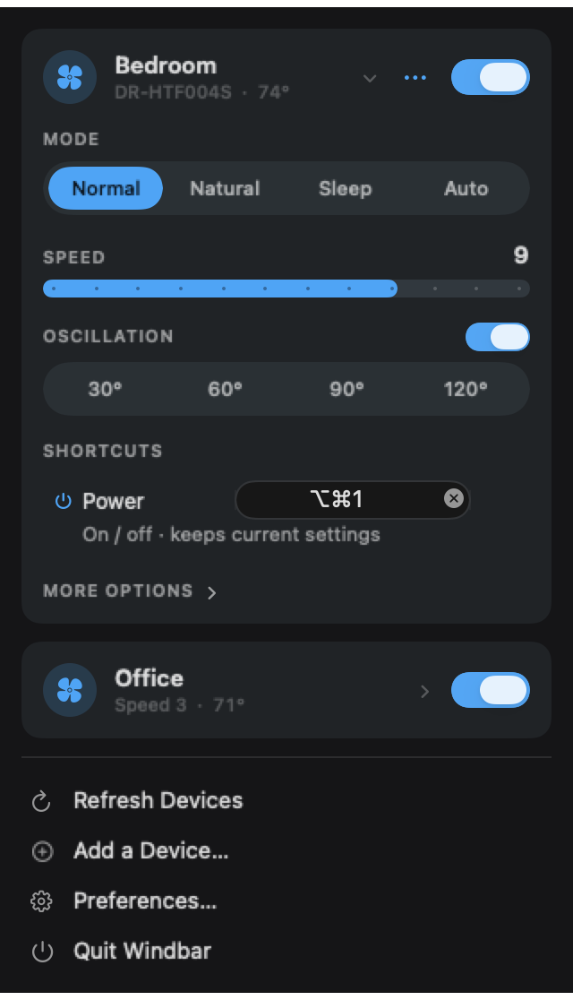

# Windbar

A little macOS menu bar app for controlling [Dreo](https://www.dreo.com) smart fans, and along the
way, the first public write-up of how Dreo's Bluetooth pairing actually works.

<p align="center">
  <a href="https://github.com/sponsors/lucid-fabrics">
    
  </a>
  <a href="https://ko-fi.com/lucidfabrics">
    
  </a>
  <a href="https://buymeacoffee.com/lucidfabrics">
    
  </a>
</p>

<p align="center">
  
</p>

## Why this exists

I wanted to turn a fan on from my keyboard. That's it. That was the whole idea.

The official route is the Dreo phone app, which is fine but means picking up a phone.
[Home Assistant](https://github.com/JeffSteinbok/hass-dreo) covers the cloud API nicely if you
already run it, but I didn't want a whole home automation stack to toggle a fan. So this is a
menu bar icon: click it, your fans are there, click again to turn one off. Give a fan a key and
you don't even have to click.

It grew a bit from there.

## What it does

- Power, speed, oscillation, mode and the fiddly per-device preferences like Child Lock
- **Presets.** Get a fan how you like it, save that as "Desk" or "Night", and bind a key to it.
  The key puts the fan back into that shape and turns it on. Press it again while the fan is
  already in that shape and it turns off, so one key is the whole round trip
- Every fan has a **Shortcuts** list: a Power key, plus a key for each of its presets
- Fans collapse to a single line each, so having five of them doesn't fill the screen
- Ambient light, colour and display controls on the models that have them
- Temperature in °C or °F, following your Mac's region unless you say otherwise
- `windbar://` URLs, so Shortcuts or a Stream Deck or a script can trigger any of it
- **Pairs a brand new fan onto your WiFi over Bluetooth, with no phone involved**
- Offline fans are shown as offline instead of pretending to work
- Your Dreo password lives in the Keychain and nowhere else

## Getting it

Needs macOS 14 or later. Two ways to get it, same app:

| | Mac App Store | Download here |
|---|---|---|
| Updates | through the App Store | in-app, "Check for Updates…" |
| Sandboxed | yes | no, the updater needs to replace the app |
| Get it | listing not live yet | [Releases](https://github.com/lucid-fabrics/windbar/releases/latest) |

The download is signed and notarised, so it opens without Gatekeeper arguing. Both builds share
a bundle id and read the same settings, so moving from one to the other keeps your presets and
keys. It does not carry your Dreo password across, because the Keychain ties a saved password to
the certificate that saved it and the two builds are signed differently. You sign in once more,
and that's the whole cost of switching.

Windbar is an independent project. It is not made by, endorsed by, or affiliated with Dreo. It
simply works with Dreo smart fans.

One catch worth knowing before you try: **you need a Dreo account with an actual password.**
If you signed up with "Continue with Google" or "Sign in with Apple", this won't work, because
the login endpoint only accepts `grant_type=email-password`. Nothing I can do about that from
the outside.

## Building from source

You need macOS 14 or later and Xcode. The `.xcodeproj` is generated rather than committed, so:

```bash
brew install xcodegen
git clone https://github.com/lucid-fabrics/windbar.git
cd windbar
xcodegen generate
open Windbar.xcodeproj
```

Press Cmd-R on the `Windbar` scheme. The fan icon appears in the menu bar and there's no Dock
icon. `Windbar-Direct` is the other scheme, the one that builds the downloadable copy with the
updater in it; you only need it when working on the updater itself.

Adding or removing a source file means running `xcodegen generate` again, since the project file
is generated from `project.yml` and nothing is going to notice on your behalf.

## How it works

Two completely separate conversations are going on.

**Talking to fans that are already set up** happens through Dreo's cloud. You log in over REST,
get back a token and a region, then open a WebSocket and send commands down it. The fan is
listening to that same socket, so changes show up in about the time it takes to let go of the
mouse. Nothing is local: your Mac talks to Dreo's servers, and Dreo's servers talk to the fan
sitting three feet away. Slightly absurd, but that's how the hardware was built.

**Setting up a brand new fan** happens over Bluetooth, directly, with no cloud in the middle.
That's the part nobody had documented.

### The controls draw themselves

The nicest thing I found: Dreo's API tells you what a device can do. Every fan comes back with a
`controlsConf` blob describing its own controls, like "I have a Speed control with values 1 to 12"
and "I have four modes and here's what they're called". So the app doesn't know what a tower fan
is. It reads the schema and renders whatever it's told, which is why an air circulator and a
tower fan both work without a line of model-specific code.

That held up until I paired a newer fan and it came back with this:

```json
"controlsConf": { "template": "DR-HPF008S" }
```

No controls. Just a pointer at a template that lives inside Dreo's own app. Newer products ship
their UI in the app binary rather than from the server, so the API alone leaves them with a power
switch and nothing else.

The fix was to go get that template. It's in `app_config.json` inside the Android app, keyed by
model, in the same shape the server uses for older devices. So `Windbar/Resources/DeviceTemplates.json`
is that file, cut down to just the controls, with the localisation keys resolved to English. 84
models, 40 KB. The server's own schema always wins where it sends one; the bundle only fills gaps,
and an unknown model is left blank rather than borrowing another model's buttons.

Even the stolen template turned out to be incomplete. The same fan has a Turbo mode and a whole
set of ambient light controls that exist on the hardware and appear nowhere in its template.
Those were mapped by sending values at a real fan and watching what it did, which is also how I
learned that its light speed goes 1 to 3 and not 1 to 9 like my first sloppy probe suggested.
They live in `DeviceTemplateOverrides.json`, a small hand-maintained layer on top of the
extracted file, so regenerating the big one from a newer app version can't erase what the
hardware taught us. Every entry carries a note saying where its values came from.

There's a related trap I walked straight into. That template-only device didn't just render
badly, it **broke decoding entirely and took the whole device list down with it**, so the app
showed nothing at all and blamed it on a failed login. Both the device list and the control
sections now decode item by item and drop only what they can't parse. One weird device shouldn't
be able to hide the rest of your account.

### Pairing over Bluetooth

<p align="center">
  
</p>

This took an embarrassing amount of the total effort.

Decompiling the Android app suggested a GATT service `FFB4` with the WiFi password RSA-encrypted
into a fixed byte layout. I implemented all of it. Unit tested it. Then pointed it at a real fan,
which advertised service `FFFF` and ignored everything I said. The `FFB4` code belongs to a
different Bluetooth SDK the same app also ships, for other products. Static analysis had given me
a confident, complete, wrong answer.

What finally worked was watching the real thing. I patched the Android app with a Frida gadget
and hooked its Bluetooth calls while pairing a fan for real. The protocol turned out to be
[CBOR](https://www.rfc-editor.org/rfc/rfc8949.html) messages over one write characteristic and
one notify characteristic, with the WiFi password in **cleartext**. No RSA anywhere. Bluetooth's
own link encryption is the only thing protecting it.

| | |
|---|---|
| Service | `0000ffff-0000-1000-8000-00805f9b34fb` |
| Write | `00009b01-0000-1000-8000-00805f9b34fb` |
| Notify | `00009b02-0000-1000-8000-00805f9b34fb` |
| Advertises as | `DREO` plus a suffix, like `DREOpf08s8E` |

Every message is `{"t": <type>, "v": <version>, "d": <payload>}`:

| Type | Who | Meaning |
|---|---|---|
| `st` | app | Set the clock |
| `rd` / `ri` | both | Ask the fan who it is, and its answer |
| `pd` | app | Which account and which API host to phone home to |
| `rw` / `wl` | both | Ask for a WiFi scan, results streamed back in batches |
| `cw` | both | Here are the credentials, then progress reports |
| `cf` | fan | Final verdict, including its own internet self-check |
| `ee` | fan | Something went wrong |

**The order is not optional, and this cost me hours.** Send `st` then `rw` then `cw` and the fan
rejects the join, even when the `cw` bytes are byte-for-byte identical to a capture of a
successful pairing. I diffed them. They matched exactly. The fan still said no.

What it actually wants is the same opening the real app uses: `st`, then `rd`, then `pd`, and only
then `rw` and `cw`. Introduce yourself and say which account you're acting for before asking it to
join a network. Add those two messages and it works first time.

I never did decode `ee`. It comes back with four bytes, `03 02 00 01`, and the official app's own
parser expects a completely different shape for that message, so it apparently never receives one.
If you figure it out, I'd like to know.

### One more sharp edge

Along the way I convinced myself the problem was Bluetooth packet size, since Dreo's app calls
`requestMtu(512)` and warns in its own source that large writes fail on peripherals that can't
reassemble them. CoreBluetooth gives you no way to request an MTU, so this looked like a dead end
for a 213-byte message.

Then I measured it. macOS had already negotiated 515. The theory was dead on arrival, and I'd have
wasted a day "fixing" it if I'd trusted the reasoning instead of printing the number.

## The code

```
Windbar/
├── App/           AppModel, the single source of truth. Entry point.
├── Models/        Data types, the CBOR codec, BLE message builders
├── Services/      REST client, WebSocket client, BLE pairing
├── Repositories/  Keychain and UserDefaults
└── Views/         Menu bar, settings, login, pairing wizard
```

Swift 6 with strict concurrency on. `@MainActor @Observable` for app state, actors for anything
doing I/O, protocols and hand-written fakes for tests rather than a mocking framework. 157 tests,
none of which touch the network or the real Keychain.

Two app targets are generated from `project.yml`, sharing one `sources` line so they can't drift
apart on file membership. They differ in exactly two ways: the download build drops the sandbox
and links [Sparkle](https://sparkle-project.org) for updates, and the App Store build does
neither. That split exists because a Swift package dependency can be excluded from a target but
not from a configuration, and an App Store binary carrying a self-updater is a rejection. Two
targets is what makes the store build provably free of it rather than merely not calling it.

The CBOR encoder is about 250 lines and hand-rolled, because pulling in a dependency to write
maps and integers felt worse than writing it. One thing it does deliberately: **map keys keep
their insertion order**. Swift dictionaries don't, and the wire format has to match what the fan
expects.

Colours come from Dreo's own product photography, which sits almost entirely in a narrow band of
sky blue. Every accent pairing was checked for contrast rather than eyeballed, which is why light
and dark use different blues: white text needs a deeper blue than dark text does.

## Macro keys and other triggers

If you have a Corsair G-key, a Stream Deck button or a foot pedal, set it to **send a keystroke**
rather than to launch an application. Macro software swallows the raw key and never passes it on,
so nothing reaches this app to record, but every one of these tools can emit a normal combination
instead. Assign the key something like Ctrl-Opt-2, then record that combination in the fan's
Shortcuts list, on the Power row or on a preset. From then on it behaves like any other shortcut.

- **iCUE** - Key Assignments tab, select the key (e.g. G1), set Assignment Type to **Keystroke**,
  not Macro or Launch Application, then remap it to something like Ctrl+Alt+1
- **Stream Deck** - drag the **Hotkey** action onto a button, click the key field, then press the
  combination directly (or type it in) rather than choosing System/App actions
- **Karabiner-Elements** - Simple Modification (or a Complex Modification rule), map the physical
  key to a **To** event with the modifiers set, e.g. `left_control` + `left_option` + `1`
- **Foot pedals / other HID macro pads** - same idea: whatever field lets you record a raw
  keystroke rather than a named command or app launch

For scripting and automation, each control is also reachable by URL:

```bash
open "windbar://toggle?device=<serial>"                          # power
open "windbar://preset?device=<serial>&preset=<uuid>"            # fire a preset
open "windbar://set?device=<serial>&key=windlevel&value=9"       # exact speed
open "windbar://adjust?device=<serial>&key=windlevel&delta=1"    # one step faster
```

`Copy Trigger Link` in a fan's menu puts its URL on the clipboard, and a preset's own menu does
the same for its `windbar://preset` link. `adjust` clamps to the range the fan itself publishes,
and `key` accepts any command from that device's schema, so `windtype` and `shakehorizon` work
the same way. Without `device`, `toggle` hits whichever fan you used last.

### If the key is assigned correctly and still does nothing

Software like iCUE, the Stream Deck app, or Karabiner-Elements doesn't send a keystroke itself.
It hands the combination to a **virtual keyboard driver** it installs at the OS level, and that
driver is what macOS actually sees. If the driver gets stuck mid-upgrade, which happens to iCUE
after Corsair ships a new version, the app still shows your key assignment as correct, but there
is no working virtual device behind it, so nothing arrives.

Two things confirm this from a terminal:

```bash
systemextensionsctl list                       # look for your macro app's driver
ioreg -c IOHIDDevice -r -d 1 | grep -i virtual  # is a virtual keyboard actually present?
```

An entry stuck on something like `terminating for upgrade` instead of `activated enabled`, or no
virtual device in the second command at all, means the driver never finished restarting. A reboot
is what actually clears it, reopening the macro app's settings does not. After rebooting, test the
same combination typed on the real keyboard first to confirm Windbar's side is fine, then test the
macro key itself.

## Things that will annoy you

- Google and Apple sign-in accounts can't be used at all
- Oscillation angle is missing on circulators that use a two-axis pad, because I couldn't work out
  the encoding and didn't want to guess and move somebody's fan the wrong way
- A build you made yourself is signed with a development certificate, so Gatekeeper will complain
  about it on any Mac other than the one that built it. The releases here are notarised and don't
  have that problem
- Moving between the App Store copy and the download makes you sign in to Dreo once more
- Deleting a device really deletes it, from the account, everywhere. There's a confirmation, and
  Return picks Cancel on purpose

## Support

This project is free and open source, built and maintained in spare time. If it saves you time, consider supporting it:

<p align="center">
  <a href="https://github.com/sponsors/lucid-fabrics">
    
  </a>
  <a href="https://ko-fi.com/lucidfabrics">
    
  </a>
  <a href="https://buymeacoffee.com/lucidfabrics">
    
  </a>
</p>

## Credit

The cloud side was much easier to work out because
[JeffSteinbok/hass-dreo](https://github.com/JeffSteinbok/hass-dreo) had already mapped it for
Home Assistant. If you want a Home Assistant integration, use that.

The Bluetooth side, as far as I can tell, hadn't been published anywhere. Now it is.

## Legal

Not affiliated with, endorsed by, or supported by Dreo or Hesung Innovation. This is
interoperability work on hardware I own, so I could turn my own fan on from my own keyboard.
Use at your own risk.

MIT, see [LICENSE](LICENSE).
